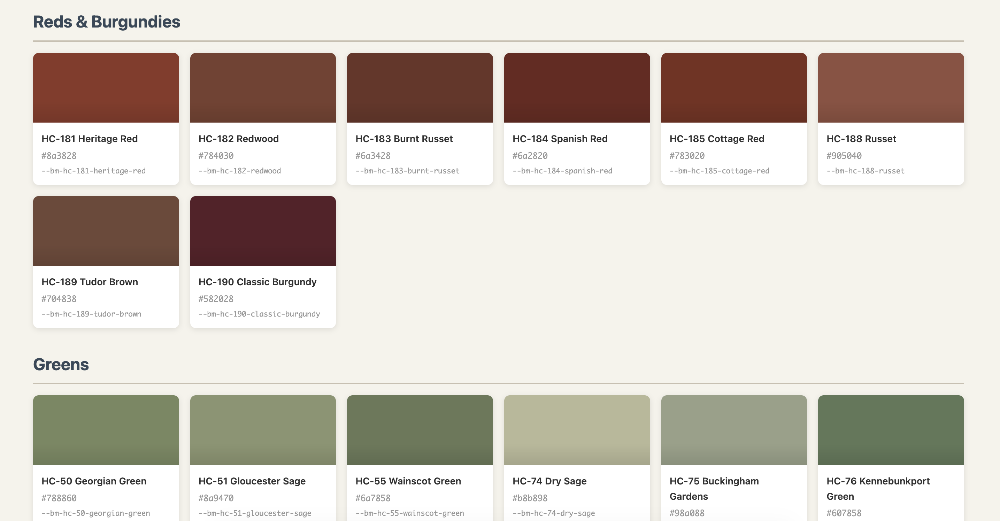

# Benji Moore Historical Collection CSS Theme 🎨 🕯️

A CSS theme featuring 191 colors from the Benjamin Moore Historical Collection — classic paint colors inspired by authentic American architecture and design through the centuries.



## Installation

### Option 1: Direct Download
Download `benji-moore-historical.css` and include it in your project:

```html
<link rel="stylesheet" href="benji-moore-historical.css">
```

### Option 2: Copy to Your Project
Copy the CSS file into your project's stylesheets directory and import it:

```css
@import url('benji-moore-historical.css');
```

## Usage

### CSS Custom Properties (Variables)

All colors are available as CSS custom properties. Use them anywhere in your stylesheets:

```css
.header {
  background-color: var(--bm-hc-154-hale-navy);
  color: var(--bm-hc-158-chantilly-lace);
}

.card {
  background-color: var(--bm-hc-172-revere-pewter);
  border: 1px solid var(--bm-hc-153-pewter);
}

.accent {
  color: var(--bm-hc-181-heritage-red);
}
```

### Semantic Aliases

For convenience, semantic color aliases are included:

```css
/* Primary Palette */
--bm-primary-light    /* Palace Pearl */
--bm-primary          /* Revere Pewter */
--bm-primary-dark     /* Kendall Charcoal */

/* Accent Colors */
--bm-accent-gold      /* Princeton Gold */
--bm-accent-green     /* Kennebunkport Green */
--bm-accent-blue      /* Hale Navy */
--bm-accent-red       /* Heritage Red */

/* Neutral Scale (100-800) */
--bm-neutral-100 through --bm-neutral-800

/* Background Colors */
--bm-bg-light, --bm-bg-warm, --bm-bg-cool, --bm-bg-dark

/* Text Colors */
--bm-text-primary, --bm-text-secondary, --bm-text-muted, --bm-text-inverse

/* Surface Colors */
--bm-surface-light, --bm-surface-warm, --bm-surface-cool
```

### Utility Classes

Quick utility classes for common styling:

```html
<!-- Background colors -->
<div class="bg-revere-pewter">Warm neutral background</div>
<div class="bg-hale-navy">Navy background</div>
<div class="bg-heritage-red">Red accent background</div>

<!-- Text colors -->
<p class="text-hale-navy">Navy text</p>
<p class="text-kendall-charcoal">Charcoal text</p>

<!-- Border colors -->
<div class="border-revere-pewter">Neutral border</div>
```

## Color Categories

The collection is organized into these categories:

| Category | Example Colors |
|----------|---------------|
| **Whites & Off-Whites** | Palace Pearl, Chantilly Lace, Indian White |
| **Yellows & Golds** | Hawthorne Yellow, Princeton Gold, Adams Gold |
| **Oranges & Terra Cottas** | Greenfield Pumpkin, Terra Cotta, Lexington Caramel |
| **Reds & Burgundies** | Heritage Red, Classic Burgundy, Cottage Red |
| **Greens** | Kennebunkport Green, Hunter Green, Calming Green |
| **Blues** | Hale Navy, Wythe Blue, Newburyport Blue |
| **Purples & Violets** | Violet Pearl, Hazy Lilac, Old Amethyst |
| **Grays** | Kendall Charcoal, Chelsea Gray, Pewter |
| **Neutrals & Taupes** | Revere Pewter, Edgecomb Gray, Shaker Beige |

## Popular Colors

Some of the most popular colors in the Historical Collection:

| Color | Variable | Hex |
|-------|----------|-----|
| Revere Pewter | `--bm-hc-172-revere-pewter` | `#c8c0b0` |
| Hale Navy | `--bm-hc-154-hale-navy` | `#384858` |
| Kendall Charcoal | `--bm-hc-166-kendall-charcoal` | `#686868` |
| Edgecomb Gray | `--bm-hc-73-edgecomb-gray` | `#d4ccc0` |
| Wythe Blue | `--bm-hc-94-wythe-blue` | `#a8b8b8` |
| Shaker Beige | `--bm-hc-45-shaker-beige` | `#d4c0a0` |
| Kennebunkport Green | `--bm-hc-76-kennebunkport-green` | `#607858` |
| Heritage Red | `--bm-hc-181-heritage-red` | `#8a3828` |
| Princeton Gold | `--bm-hc-14-princeton-gold` | `#c5a855` |
| Chantilly Lace | `--bm-hc-158-chantilly-lace` | `#f8f8f8` |

## Demo

Open `index.html` in your browser to see an interactive preview of all colors with:
- Visual swatches for each color
- Color names, hex codes, and CSS variable names
- Filter buttons to browse by category
- Example usage with demo buttons

## Browser Support

This theme uses CSS Custom Properties (CSS Variables), which are supported in all modern browsers:
- Chrome 49+
- Firefox 31+
- Safari 9.1+
- Edge 15+

## License

This CSS theme is free to use for personal projects.

*Note: Benjamin Moore® and the color names are trademarks of Benjamin Moore & Co. This theme is an independent project and is not affiliated with or endorsed by Benjamin Moore & Co. "Benji Moore" is a playful nickname for this project. Go buy their paint colors, they're nice.*
